## re:Invent 2017 - SID402

# Module 2 - Implementing Security with AWS IoT

### Introduction

The security enhancement project at IthaCorp is in full gear and you are continuing the process of implementing controls across the four CAF Security Perspective areas; **Directive**, **Preventative**, **Detective** and **Responsive**. Unexpectedly, you are approached by the business to support the launch of IthaCorp Telemachus, a new IoT Service offering that transforms traditional cities into "smart" cities by using IoT technology to improve efficiency through device instrumentation, analytics and automation. Your role is provide assistance with the security configuration of the AWS IoT resources. This is a critical service launch for the business so you get started immediately.

In this module, you will set up an environment using the AWS IoT (Internet of Things) service. You will create a simulated device (a thing) and connect it to the AWS IoT service and watch traffic flow between the device and AWS IoT. You will then enhance the security of the communication between the device and AWS IoT and, in so doing, learn more about the various security features offered by the service.

### Architecture Overview


*Note: Going forward, we will use the terms device and thing interchangeably.*

### Topics covered

By the end of this module, you will be able to:

* Create a test AWS IoT environment using AWS CloudFormation. The environment will contain an Amazon EC2 instance running a package named [Node-RED](https://en.wikipedia.org/wiki/Node-RED). Node-RED provides a web-based interface that allows you to create message flows (i.e. sequences of transmissions). Node-RED can send these message flows using the MQTT and TLS protocols, which are used by AWS IoT. In short, Node-RED lets you simulate an AWS IoT device (a thing).

* Configure Node-RED to simuilate AWS IoT device (a thing) and then test communication with the AWS IoT service.

* Adjust the security permissions within AWS IoT to more tightly restrict the communication to AWS IoT.

### Prerequisites

This module assumes you have a general knowledge of AWS services and that you have an AWS account with an IAM user that has full administrative privileges. Additionally, only one person should do this module in a specific AWS account in a given region. If more than one person is using the same AWS account for this module at the same time, each must use a different AWS IoT region.

### 1. Choose a Region

AWS IoT is located in many [regions](http://docs.aws.amazon.com/general/latest/gr/rande.html#iot_region) across the world. We will provide shortcuts for the regions we want you to use later in this lab. As noted above, if more than one person is doing the module in the same AWS account, each person should use a different region.  Please use the same region throughout the lab.

**Tip** The AWS region name is always listed in the upper-right corner of the AWS Management Console, in the navigation bar.

### 2. Build the Node-RED Environment

Our modules will use AWS CloudFormation to provision a web-based environment with Node-RED. Node-RED allows you to simulate an IoT device including the sending and receiving of IoT messages using the MQTT protocol. The AWS CloudFormation template will create a complete environment consisting of an Amazon VPC and an Amazon EC2 instance on which Node-RED will be installed.

- __2.1.__ Sign in to the AWS management console at: <https://console.aws.amazon.com/console/home>

- __2.2.__ Click the link below corresponding to the region in which you wish to deploy the environment.
___Hold the "Control" key while clicking and open the launch link in a new tab___

Region| Launch
------|-----
Ireland (eu-west-1) | [](https://console.aws.amazon.com/cloudformation/home?region=eu-west-1#/stacks/new?stackName=SID402-IoTSecurityLab&templateURL=https://s3-us-west-2.amazonaws.com/sid402-artifacts/scripts/IoT_Security_Lab_VPC.yaml)
London (eu-west-2) | [](https://console.aws.amazon.com/cloudformation/home?region=eu-west-2#/stacks/new?stackName=SID402-IoTSecurityLab&templateURL=https://s3-us-west-2.amazonaws.com/sid402-artifacts/scripts/IoT_Security_Lab_VPC.yaml)
Singapore (ap-southeast-1) | [](https://console.aws.amazon.com/cloudformation/home?region=ap-southeast-1#/stacks/new?stackName=SID402-IoTSecurityLab&templateURL=https://s3-us-west-2.amazonaws.com/sid402-artifacts/scripts/IoT_Security_Lab_VPC.yaml)
Sydney (ap-southeast-2) | [](https://console.aws.amazon.com/cloudformation/home?region=ap-southeast-2#/stacks/new?stackName=SID402-IoTSecurityLab&templateURL=https://s3-us-west-2.amazonaws.com/sid402-artifacts/scripts/IoT_Security_Lab_VPC.yaml)
Tokyo (ap-northeast-1) | [](https://console.aws.amazon.com/cloudformation/home?region=ap-northeast-1#/stacks/new?stackName=SID402-IoTSecurityLab&templateURL=https://s3-us-west-2.amazonaws.com/sid402-artifacts/scripts/IoT_Security_Lab_VPC.yaml)
Seoul (ap-northeast-2) | [](https://console.aws.amazon.com/cloudformation/home?region=ap-northeast-2#/stacks/new?stackName=SID402-IoTSecurityLab&templateURL=https://s3-us-west-2.amazonaws.com/sid402-artifacts/scripts/IoT_Security_Lab_VPC.yaml)

- __2.3.__ A new browser tab or page will appear with the CloudFormation template selected. Click on **Next** to be taken to the list of parameters.  Click on **Next** to accept the default values.

- __2.4.__ On the next page, you can create tags to be applied to resources, then click **Next**.

- __2.5.__ Review the settings. When requested, click the check box to acknowledge that IAM resources may be created and then click **Create**. You will return to the CloudFormation console. The process will take five to seven minutes to complete. While the stack is building, proceed to the next page to create your first AWS IoT device (a thing).

___Complete all the steps below. Use arrow to expand sections marked with "(expand for details)".___

### 3. Complete Initial Environment Configuration

<details open>
<summary><strong>3.1. Define Device (expand for details)
</strong></summary><p>
<br/>

You will now define an IoT device. A device is recognized by AWS IoT through a certificate. You will create a certificate and attach it to the device. You will also attach a policy to the device that gives the device (thing) full access to AWS IoT. Later in this module, you will configure the Node-RED with this certificate which will cause AWS IoT to recognize Node-RED as an AWS IoT device.

- __3.1.1.__ Make sure you are still working in the same AWS region in which you are building the AWS CloudFormation stack.

- __3.1.2.__ Select the service **AWS IoT** from the AWS Console. If you see a **Get started** button, click that.

- __3.1.3.__ From the menu on the left, select **Manage**, **Things** and the click the **Register a thing** button (if there are already things listed, click the **Create** button instead).

- __3.1.4.__ Enter the name `device1` and click **Create thing**. You should see a new entry as shown below.

    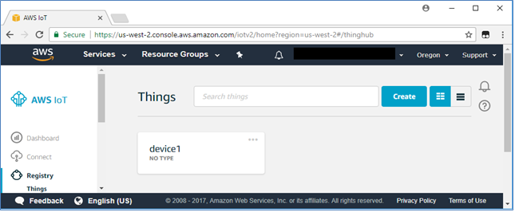

- __3.1.5.__. On the left select **Secure**, then **Certificates**, then click **Create a certificate** and then Click **Create certificate.** You will then be presented with a page telling you the certificate has been created and given the opportunity to download four items as shown below. Continue below this picture for download instructions.

    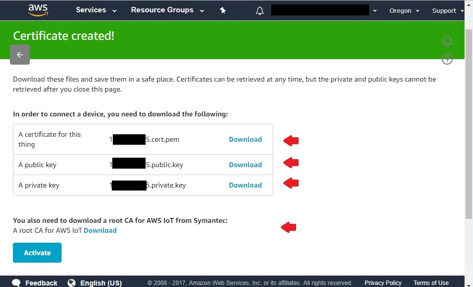

    Use the top three download links to download the certificate, public key, and private key to a folder on your system. Also download the root CA from the link above the Activate button by right-clicking and saving the file as **rootCA.pem**. To clarify, you are downloading **four** separate items!  Once done and verified you have the files locally saved, click **Activate** and then scroll to the bottom of the window and click **Attach a policy**.

    You have thus far created a device and a certificate. You will now define what the holder of the certificate (which will eventually be Node-RED running on Amazon EC2) can do.

- __3.1.6.__ Click **Create new policy**.

- __3.1.7.__ On the **Create a policy** page create the statement as follows:

    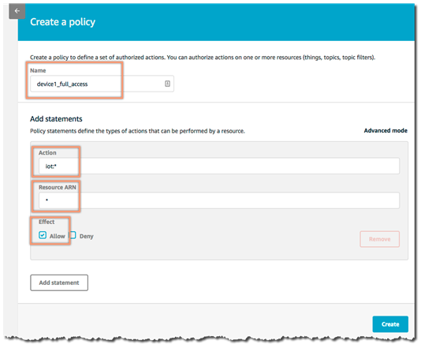

    **Name**: device1_full_access

    **Action**: iot:*

    **Resource ARN**: *

    **Effect**: Allow

    This represents a policy named device1_full_access that can perform all iot actions ( iot:* ) on all resources. In other words, the policy will grant full IoT access to any certificate to which the policy is attached.

- __3.1.8.__ Select **Create**.

- __3.1.9.__ From the main AWS IoT menu, select **Secure**, **Certificates.**

- __3.1.10.__ Select the certificate that you created above by hovering over the certificate and checking the blue box that appears. With it checked, select the drop-down menu **Actions** and click on **Attach policy**. Then select the **device1_full_access** policy and click **Attach**. You have now attached the policy to the certificate.

- __3.1.11.__ Select the drop-down menu **Actions** and click on **Attach thing** and select the thing named **device1**. Click **Attach**. You have now attached the certificate with its policy to the device. Later in this module, you will configure Node-RED with the certificate that has this policy causing, Node-RED to be recognized by AWS IoT as **device1**.

- __3.1.12.__ On this AWS IoT console home page, near the bottom left click Settings. Copy the value in the **Endpoint** field and save it in a text file. You will need this value later in the module when you configure Node-RED.
</details>

<details open>
<summary><strong>3.2. Configure Node-RED (expand for details)
</strong></summary><p>
<br/>

- __3.2.1.__ By this point, the CloudFormation stack with the Node-RED Amazon EC2 instance should be complete Go to the AWS CloudFormation console, select the stack and look at the output tab. If you do not see the output tab, refresh the CloudFormation console page.  You should see the following values:

    **HostIPAddress**: The IP address of the EC2 instance

    **NodeREDURL**: The URL of the EC2 instance

- __3.2.2.__ Browse to the URL and you should see Node-RED appear.  If you receive a timeout message or your browser pauses, the initial set up of the instance may still be taking places.   In that case, just wait a minute or two and try again.  Firefox users may have difficulty viewing Node-RED.  If so, please try Chrome, IE, or Safari.

    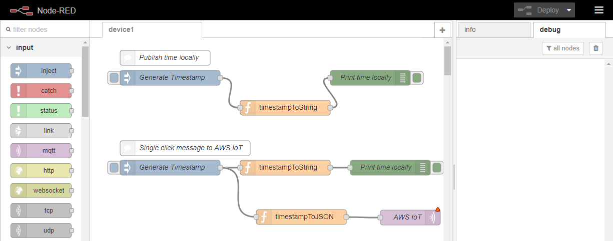

    The interface has three sections. Going from left to right:

    **Nodes**: These represent actions or objects for Node-RED.

    **Flow Canvas**: You position nodes, configure them, and connect them on the canvas to create message flows.

    **Info/Debug**: The info tab will provide more details on the selected node. The debug tab will show in real time all activity for the debug nodes.

    Click on the **device1** tab. This will display the two flows to be tested. The first flow, **Publish time locally**, generate a binary timestamp (the Generate Timestamp node), then have that converted to a friendly date and time (the timestampToString node), and then finally print the time to the debug window (the Print Time node). The second flow will do something similar, except you will see there is an additional output to be configured to send the message to the AWS IoT service.

    **First flow - Publish time locally**

- __3.2.3.__ On the right side of the make sure the debug tab is selected.

- __3.2.4.__ On the Generate Timestamp node for Publish time locally, click the button on the left side. This will generate the timestamp, then convert and send. You will see the message in the debug frame. Every click on the inject node (Generate Timestamp) will publish a message in the debug window. See the vertical red arrows below for clarification.

    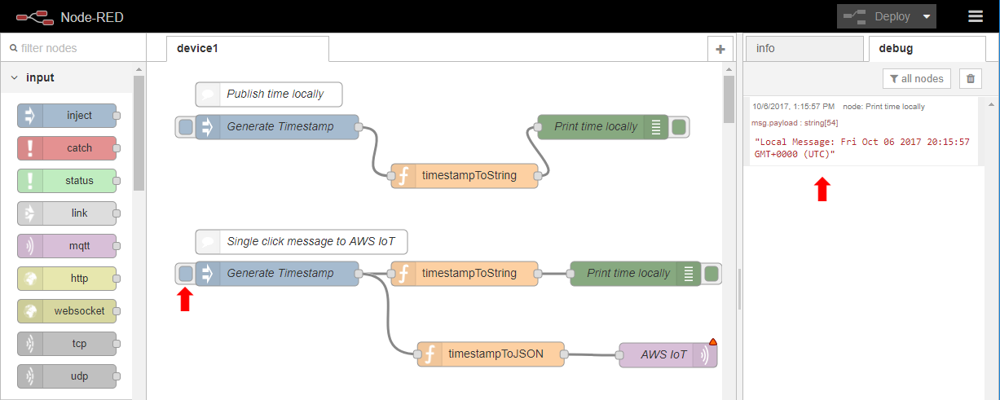

    **Second flow - Single click message to AWS IoT**

- __3.2.5.__ The second flow under **Single click message to AWS IoT** does two things. Like the first flow, Node-RED will print a timestamp locally. Additionally, there is also a branch flow which translates the time to JSON format (the timestampToJSON node) and then sends the message to AWS IoT (the AWS IoT node). You will see a red alert icon on the upper right corner of the AWS IoT node because some configuration information is missing.

    To configure the AWS IoT node, double-click it. This will bring up a window that allows you to edit the MQTT properties of the node. [MQTT](https://en.wikipedia.org/wiki/MQTT) is one of the underlying network protocols used by AWS IoT. Click the pencil icon as shown below by the red arrow.

    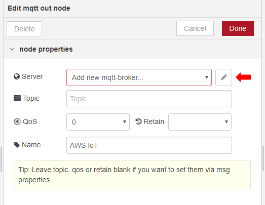

    Another window will appear on which you will enter MQTT configuration information.

    On the Connection tab, configure the following:

    **Server**: Endpoint value that you copied earlier

    **Port**: 8883 (Make sure you use this value otherwise your messages will not go through!)

    **Client ID**: device1

    Now check the box named Enable Secure SSL/TLS communication. The window should like similar to that shown below.

    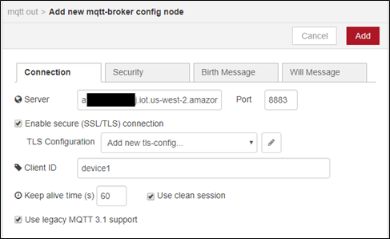

- __3.2.6.__ Click the pencil next to the Add new tls-config dropdown as shown by the red arrow above. A new window will appear as shown below.

    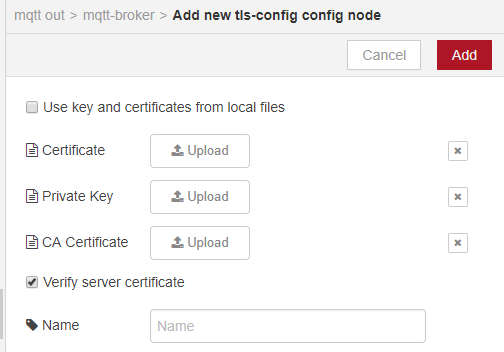

- __3.2.7.__ On the Add new-tls-config screen, make sure the **Use key and certificates from local files** is deselected (which would cause Node-RED to use files on the Node-RED instance itself), and instead select the Upload button for each and navigate to the directory where the files are saved. The files will have names similar to the following:

    **Certificate**: c1234567-certificate.pem

    **Private Key**: c1234567-private.pem.key

    **CA Certificate**: rootCA.pem

    **Verify server certificate**: selected

    **Name**: IoT Security Lab

    If for some reason you forgot to download the **rootCA.pem** file earlier, you can right click on the following link, open it in a new tab and save the value into a file named **rootCA.pem**:

    [[rootCA.pem]](https://www.symantec.com/content/en/us/enterprise/verisign/roots/VeriSign-Class%203-Public-Primary-Certification-Authority-G5.pem)

- __3.2.8.__ Then click **Add**, which will bring you back to the **Add mqtt-broker config node** window.

- __3.2.9.__ From the mqtt-broker config node page, click **Add**. You will return to the **Edit mqtt out node** window.

- __3.2.10.__ Enter the following information into the fields in the window.

    **Topic:** topic1

    **QoS**: 0

    **Name:** AWS IoT

    The server name will already be filled in based on the information you have provided as shown in the screen below. Later in the module, we will show how to subscribe to messages sent to **topic1** to verify communication from AWS IoT and Node-RED.

    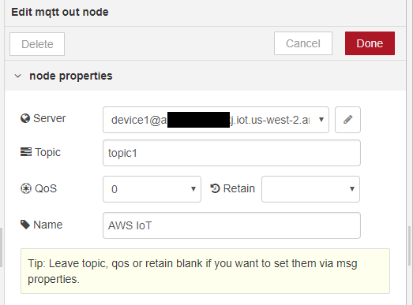

- __3.2.11.__ Click **Done** to go back to the main GUI.

- __3.2.12.__ Finally, notice that the **Deploy** icon in the upper right of the GUI is red. If you do not do this, your changes will not be enabled!  This means changes have been made and need to be deployed. Click on this button and the flow will be saved, validated, and ready for use. If validation succeeds, the AWS IoT node (the Node-RED Amazon EC2 instance) will connect to the AWS IoT platform. You should see a green icon with connected under the AWS IoT node, Node-RED was able to successfully connect to the AWS IoT platform.

- __3.2.13.__ Bring up the AWS Console in a new browser window or tab and navigate to the AWS IoT console and select **Test**. Then select Subscribe to a topic link, enter **topic1** as the topic, and finally click the Subscribe to topic button per the figure below.

    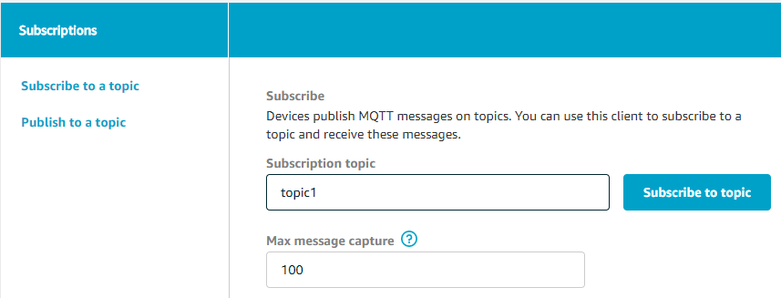

    The MQTT client will then appear as shown below.

    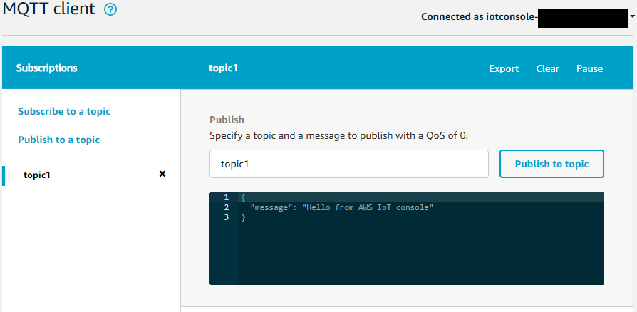

- __3.2.14.__ Return to the Node-RED window. Clean out the debug window by clicking the trash can icon. Click the button to the left of the Generate Timestamp node for the Single click message to AWS IoT flow. You will see the friendly date and time posted in the debug window, but you will also see the message published in the MQTT client in the AWS Console. Notice also that the AWS IoT node continues to show that it is connected which means that the policy attached to the certificate does allow the desired communication.

    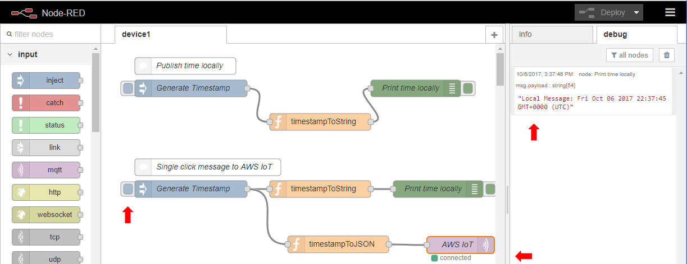

- __3.2.15.__ Now return to the AWS IoT window with the MQTT client. You should see a message that was published to topic1 as shown in the figure below.

    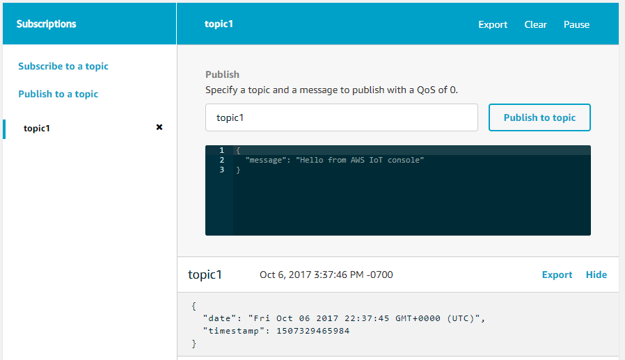

    You have now done the following:

    * Defined an IoT device.

    * Created a certificate and attached a policy which has full access to AWS IoT

    * Launched a Node-RED instance on AWS and configured Node-RED with the certificate information from AWS IoT, thereby enabling the Node-RED instance to simulate an IoT device and communicate with AWS IoT

    * Captured traffic from Node-RED within AWS IoT.

    You will now learn how to restrict access to AWS IoT.
</details>

### 4. Restricting Access to AWS IoT

<details open>
<summary><strong>4.1. Create Permissions for Device Specific Topics (expand for details)
</strong></summary><p>
<br/>

Earlier in this module you created a policy for your AWS IoT certificate that was very open and allowed the holder of that certificate to publish to any IoT topic. We are now going to show you how to restrict that policy so it only allows publishing to the topic we have already created.

- __4.1.1.__ Go to the main IoT console and choose **Secure**, **Policies**. You should see a policy named device1_full_acccess. Click directly on the policy name.

    On the top of the window you will see the policy ARN (Amazon Resource Name). It will look something like:

    `arn:aws:iot:us-west-2:123456789012:policy/device1_full_access`

    Copy the region name (`us-west-2` in the above example) and the account number (`123456789012` in the above example) to a scratch file for future use.

- __4.1.2.__ Go back to the main IoT console and choose **Secure**, **Policies**. Click **Create**.

    Enter `device1_allow_publish` and click **Advanced mode.**

- __4.1.3.__ Replace the JSON with the content below, replacing `REGION` and `ACCOUNT` with the values you copied earlier. Make sure you retain all of the colon (:) separators.

````
    {
      "Version": "2012-10-17",
      "Statement": [
        {
          "Effect": "Allow",
         "Action": [
            "iot:Subscribe",
            "iot:Connect",
            "iot:Receive"
          ],
          "Resource": [
            "*"
          ]
        },
        {
          "Effect": "Allow",
          "Action": [
            "iot:Publish"
          ],
          "Resource": [
            "arn:aws:iot:REGION:ACCOUNT:topic/topic1"
          ]
        }
      ]
    }

````

- __4.1.4.__ Click **Create**.

- __4.1.5.__ Navigate to **Secure**, **Certificates** and select your certificate then click on **Policies**. Now select **Attach policy** under Actions and select **device1_allow_publish**. Then detach the **device1_full_access** policy from the certificate.

- __4.1.6.__ Go to the IoT console and select **Test**. Subscribe to **topic1**.

- __4.1.7.__ Go to the Node-RED window and generate another message under **Single click message to AWS IoT**. You should see messages continue to appear on the test window. The AWS IoT node should continue to remain connected.
    You have now restricted the AWS IoT device represented by Node-RED so that it can only publish to the topic named **topic1**.

- __4.1.8.__ On the Node-RED window, double click on the **AWS IoT** node. Change the topic name to **topic2**. Click **Done**. Click **Deploy**.

- __4.1.9.__ Generate another message under **Single click message to AWS IoT**. You should see the AWS IoT node disconnect for a few seconds as shown in the figure below. This is because you are only allowed to publish to topic **topic1**.

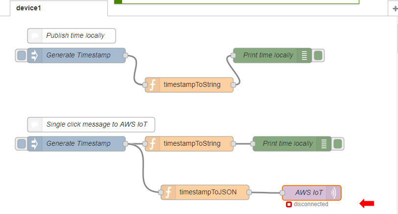
</details>

### Conclusion

Congratulations! You have now successfully:

-   Configured a device in AWS IoT

-   Launched an Amazon EC2 instance with the Node-RED platform

-   Associated Node-Red with the IoT device by attaching a certificate

-   Captured traffic from Node-RED with AWS IoT

-   Configured AWS IoT security policies to restrict actions from IoT devices

### [Continue on to Module 3](https://github.com/awslabs/aws-security-odyssey/tree/master/SID402Workshop/3_AutoSecRemediation)

### Clean Up
___Complete clean up at the end of the Workshop___
